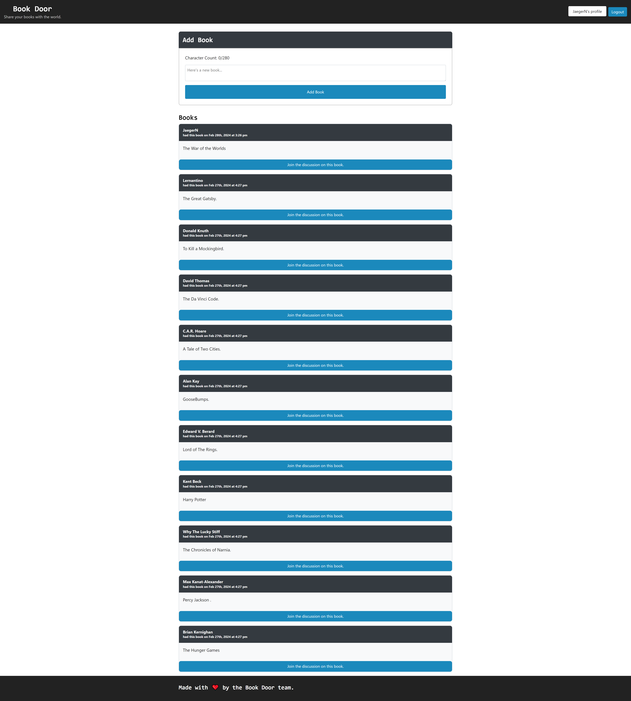

# BookDoor

## Table of Contents
1. [Description](#description)
2. [Installation](#installation)
3. [Technologies Used](#technologies-used)
4. [Usage](#usage)
5. [Screenshot](#screenshot)
6. [Credit](#credit)
7. [Contact](#contact)
8. [Development](#development)

## Description
Bookdoor is a web application where users can post books they want to trade with others. Users can browse through the listed books, and leave comments on books they're interested in. Bookdoor provides a platform for book enthusiasts to connect with each other and trade their favorite reads.

## Installation
- Install npm packages using "npm install" command
- Make sure that MongoDB is running on your machine
- Run server using "npm run develop" command
- When it loads, "Ctrl C"
- Run seeder using "npm run seed" (this will poplate the data)
- re-run script at "npm run develop"

## Technologies Used
- React.js
- Node.js
- Express.js
- MongoDB
- GraphQL
- Apollo Client
- Styled Components

## Usage
For accessing the books available on our platoform the user must create or log into an account. Once logged in, the user will be taken to the home page where the option to add a book is available. Our platform allows users to click on available books and create an offer with those who are interested. Once the user is done they can log out of their account and log back in at any point with ease. 

## Screenshot

## Credit
Front End:
* Carlos
* Jaeger:  (react)

Back End:
* Jaeger
* Riley
* Peter
* Katie

## Contact
* Github: https://github.com/JRNiles
* Github: https://github.com/RileyGlander
* Github: https://github.com/kmscheffle
* Github: https://github.com/PeterNewsome
* Github: https://github.com/carlosps444

## Deployment
